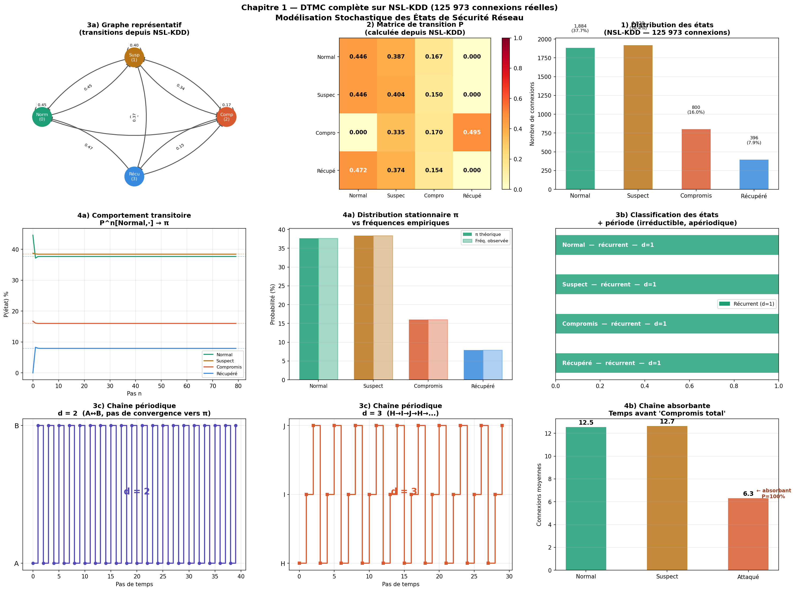

---

```markdown
# Stochastic Modeling of Computer Network Security

[](LICENSE)
[](https://www.python.org/downloads/)

> Using stochastic models and reinforcement learning to detect intrusions and adaptively respond to network security threats in real time.

This repository contains the code, notebooks, and figures for a research project that applies **Markov chains**, **Hidden Markov Models (HMMs)**, and **continuous-time HMMs** to model network traffic and detect cyberattacks. The work is based on public datasets (NSL‑KDD, CIC‑IDS‑2017) and illustrates how probabilistic graphical models can capture normal vs. malicious behavior.

---

## 📁 Repository Structure

```
.
├── chp1.ipynb                     # Introduction – DTMC for network states
├── Ch2 ctmc.ipynb                 # Continuous‑time Markov chains (CTMC)
├── ch3_dthmm.ipynb                # Discrete‑time Hidden Markov Models (DT‑HMM)
├── Ch4 cthmm.ipynb                # Continuous‑time Hidden Markov Models (CT‑HMM)
├── projet_cybersecurity/          # Main module with code, figures, and datasets
│   ├── ch1_dtmc/                  # DTMC implementation and results
│   ├── ch2_ctmc/                  # CTMC simulations
│   ├── ch3_dthmm/                 # DT‑HMM inference (Baum‑Welch, Viterbi)
│   ├── ch4_cthmm/                 # CT‑HMM for intrusion detection
│   ├── dataset/                   # Public datasets (see note below)
│   │   ├── nsl-kdd/               # NSL‑KDD sample (small, tracked)
│   │   └── MachineLearningCVE/    # CIC‑IDS‑2017 (large files ignored)
│   └── *.png                      # Figures used in the notebooks
├── .gitignore                     # Excludes large dataset files (>100 MB)
└── README.md                      # This file
```

> **Note on datasets**  
> The full CIC‑IDS‑2017 dataset is **not stored in this repository** because individual CSV files exceed GitHub’s file size limit (100 MB). Instead, you can download the dataset from the [official source](https://www.unb.ca/cic/datasets/ids-2017.html) and place the `.csv` files inside `projet_cybersecurity/dataset/MachineLearningCVE/`. The notebook `Ch4 cthmm.ipynb` expects them there.

---

## 🚀 Getting Started

### Prerequisites
- Python 3.8 or higher
- Jupyter Notebook or JupyterLab
- Recommended: create a virtual environment

### Installation

1. **Clone the repository**  
   ```bash
   git clone https://github.com/fidaear/Stochastic-Modeling-of-Computer-Network-Security.git
   cd Stochastic-Modeling-of-Computer-Network-Security
   ```

2. **Install dependencies**  
   ```bash
   pip install -r requirements.txt
   ```
   If `requirements.txt` is not present, manually install the core packages:
   ```bash
   pip install numpy pandas matplotlib scipy scikit-learn jupyter
   ```

3. **Run Jupyter Notebook**  
   ```bash
   jupyter notebook
   ```
   Open any of the chapter notebooks (e.g., `Ch4 cthmm.ipynb`) and execute the cells.

---

## 📖 Chapter Overview

| Notebook | Topic | Key techniques |
|----------|-------|----------------|
| `chp1.ipynb` | Introduction to Markov chains for network security | Discrete‑time Markov chains (DTMC), state transition probabilities |
| `Ch2 ctmc.ipynb` | Continuous‑time Markov chains | Generator matrices, sojourn times, Kolmogorov equations |
| `ch3_dthmm.ipynb` | Discrete‑time Hidden Markov Models | Baum‑Welch, forward‑backward, Viterbi decoding |
| `Ch4 cthmm.ipynb` | Continuous‑time HMMs | Intensity matrices, EM for CT‑HMM, intrusion detection on CIC‑IDS‑2017 |

Each notebook includes:
- Mathematical formulation
- Synthetic examples to illustrate concepts
- Application to real network traffic (NSL‑KDD or CIC‑IDS‑2017)

---

## 📊 Datasets

- **NSL‑KDD** – a refined version of KDD Cup 1999. A small sample (`nslkdd_sample.csv`) is included in `projet_cybersecurity/dataset/nsl-kdd/`.
- **CIC‑IDS‑2017** – modern, realistic traffic captures containing benign and malicious flows (DoS, DDoS, PortScan, Web attacks, etc.). Because of its size, you need to download it manually.

### Download CIC‑IDS‑2017
1. Visit [CIC‑IDS‑2017 on the UNB website](https://www.unb.ca/cic/datasets/ids-2017.html).
2. Download the **CSV files** (e.g., `Monday-WorkingHours.pcap_ISCX.csv`, …).
3. Place all `.csv` files inside `projet_cybersecurity/dataset/MachineLearningCVE/`.

After placing the files, the notebook `Ch4 cthmm.ipynb` will automatically load and sample them.

---

## 🧪 Results

The notebooks generate figures (stored in the respective `ch*` folders) showing:
- Transition probability matrices for normal vs. attack states
- Log‑likelihood convergence during EM training
- Detection accuracy (confusion matrices, ROC curves)

Example figure:  


---

## ⚠️ Important Notes for Contributors

- **Do not commit large files** ( > 100 MB). The `.gitignore` already excludes `*.csv`, `*.arff`, `*.zip`, etc. inside the dataset folders.
- If you modify the notebooks and want to keep the changes, make sure to **clear cell outputs** before committing (to avoid unnecessarily large diffs).  
  *In Jupyter:* `Kernel → Restart & Clear Output`.
- Use descriptive commit messages (e.g., `git commit -m "Add CT‑HMM inference for CIC‑IDS"`).

---

## 🤝 License

This project is licensed under the **MIT License** – see the [LICENSE](LICENSE) file for details.

---

## 📬 Contact & Citation

- Author: Fidaear (fidaeariyan2004x@gmail.com)  
- If you use this code in your research, please cite this repository:

  ```bibtex
  @misc{fidaear2025stochastic,
    author = {Fidaear},
    title = {Stochastic Modeling of Computer Network Security},
    year = {2025},
    publisher = {GitHub},
    url = {https://github.com/fidaear/Stochastic-Modeling-of-Computer-Network-Security}
  }
  ```

---

**Happy modeling!** 🔐📈
```

---

## Next steps to add this README to your repository

1. **Create the file**  
   In your local repository folder, create a new file named `README.md` and paste the content above.

2. **Add, commit, and push**  
   ```bash
   git add README.md
   git commit -m "Add comprehensive README"
   git push
   ```

3. **Optional** – also create a `requirements.txt` file with the dependencies listed in the README:
   ```bash
   echo "numpy>=1.21.0" > requirements.txt
   echo "pandas>=1.3.0" >> requirements.txt
   echo "matplotlib>=3.4.0" >> requirements.txt
   echo "scipy>=1.7.0" >> requirements.txt
   echo "scikit-learn>=1.0.0" >> requirements.txt
   echo "jupyter>=1.0.0" >> requirements.txt
   git add requirements.txt
   git commit -m "Add requirements.txt"
   git push
   ```
